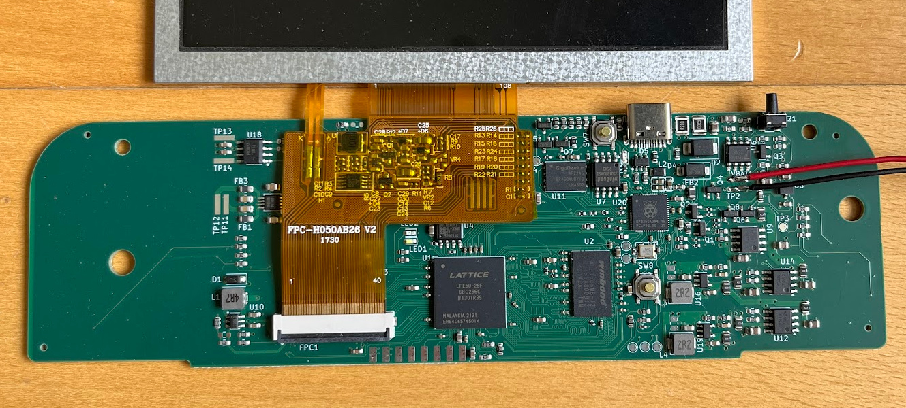
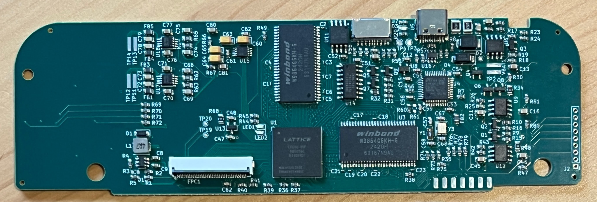

# fpgago

A handheld retro gaming console for the Commodore 8-bits, built from open
source: the **C64**, the **C16** and the **Plus/4** as real hardware cores on
a Lattice ECP5, with a 5" LCD, buttons, audio, and a companion app that
finds games and puts them on the board.



Everything here is source you can build with a free toolchain — Yosys,
nextpnr, Verilator. No vendor lock-in, no encrypted cores.

## What runs

| machine | video | sound | drive | cartridges |
|---|---|---|---|---|
| **Commodore 64** | VIC-II (cycle-accurate) | SID 6581/8580 | fastload, DOS-1541, and a full 1541 in fabric | EasyFlash |
| **Commodore 16** | TED | TED | fastload, DOS-1541, real IEC | — |
| **Commodore Plus/4** | TED | TED | fastload, DOS-1541, real IEC | — |

Each machine runs two ways: **on the board**, as a synthesized bitstream, and
**on your desktop**, as the same Verilog under Verilator with SDL2 for the
screen, sound and keyboard. The desktop simulation is the real RTL, not a
separate emulator — what you debug there is what runs on the FPGA.

## Quick start

```sh
make start
```

That launches the **desktop companion app** (it provisions a local Python
venv on first run). The app opens on the **Install** tab whenever something
is missing and walks through the rest:

1. **FPGA toolchain** (oss-cad-suite) — needed to synthesize bitstreams.
2. **Commodore ROMs** — the KERNAL/BASIC/chargen ROMs are copyrighted, so
   they are **not** shipped with the hardware or this repository. The tab
   downloads them from the VICE project after you tick the consent box.
3. **Synthesize** the c64 / c16 / plus4 bitstreams (the ROMs are baked in at
   synthesis, which is why steps 1–2 come first) — or skip straight to the
   prebuilt ROM-free bits below.
4. Connect the board over USB (**Device** tab) and flash.

The other tabs are the day-to-day drive: **Library** (search and download
games by their permanent IDs, push them to the board), **Board** (remote
control), **Files**, **Screen** (live LCD grab).

Prefer the terminal? The same flow by hand:

```sh
./setup.sh                            # base deps + FPGA toolchain
make download-rom ARCH=c64            # asks for the copyright consent
make run          ARCH=c64            # desktop simulation
make build        ARCH=c64 TARGET=fpga  # synthesize (ROMs baked in)
make help                             # everything else
```

**No toolchain? Use the prebuilt bits.** `bitstreams/c64-romless.bit`,
`c16-romless.bit` and `plus4-romless.bit` are committed and flashable as-is.
They are the same builds minus the ROMs, which the board loads at run time
from a container you build out of your own dumps — which is also why they are
the only bitstreams in this repository: they contain no copyrighted bytes.
See [`bitstreams/README.md`](bitstreams/README.md).

## Running games

```sh
make run-floppy ARCH=c64 D64=~/games/turrican.d64 PROGRAM="TURRICAN"
make run-floppy ARCH=c64 PRG=~/games/game.prg      # wrapped into a fresh disk
make run-prg    ARCH=plus4 PRG=~/games/game.prg    # baked in, autostarts
make run-crt    ARCH=c64 CRT=~/carts/game.crt      # EasyFlash cartridge
```

`run-floppy` mounts the disk on the **emulated 1541** — a real 6502 + VIA +
GCR drive, which is what fastloaders need. `FAST=1` switches to the fast
loader instead (direct RAM injection: much quicker, and enough for most
single-load games).

On the board, the same choice is a runtime switch, so one bitstream covers
every drive mode: QSPI fastload, DOS-1541, the cycle-accurate fabric 1541,
and AUTO.

## Layout

```
retro-arch/
  c64/       VIC-II + SID + CIA + 6510, EasyFlash cart port, SoC, run.sh
  c16/       TED + 8501, SoC, run.sh
  plus4/     TED + 7501, SoC, run.sh
  common/    shared fabric: BIOS overlay, keyboard, QSPI link, screen grab,
             the fabric 1541 (drive1541/) and its C reference (floppy1541/)
peripheral/  UART, LCD output, I2S audio, QSPI PSRAM controllers
util/        ECP5 primitives + simulation models, bitstream tagging, mkroms
bitstreams/  the committed ROM-free builds
desktop/     the PySide6 companion app and the game-library engine
```

Each machine directory holds `soc.v` (the machine), `project-<m>.v` (the
board top level), `run.sh` (synthesis) and `sim-desktop/` (the Verilator
harness). Machines share everything in `retro-arch/common/`.

## Checks

```sh
make check-cpu                # 6502 opcode conformance, 720 cases
make check-drive              # the fabric 1541 against the reference DOS
make check-easyflash ARCH=c64 # cart banking + flash emulation
make check-shot      ARCH=c64 # screen grab over the FPGA video path
```

## The hardware

A compact board around a Lattice ECP5-25K driving a 5" 800x480 colour LCD,
with SDRAM, a QSPI PSRAM (the EasyFlash cart image and the fabric drive's GCR
tracks live there), I2S audio, buttons, and an RP2350 companion MCU that owns
USB, the flash file system and the link the desktop app talks to.



## Licence

FPGAgo is free software under the **GNU General Public License, version 3 or
later** — see [`LICENSE`](LICENSE). Third-party cores (the VIC-II, the SID,
the CIA, the TED, the 6502) come from other open-source projects and keep
their own notices; [`THIRD-PARTY.md`](THIRD-PARTY.md) says which is which.

**No copyrighted bytes are in this repository** — no ROM images, no ROM-baked
bitstreams, no game dumps. Bring your own dumps; `make download-rom` fetches
the Commodore ROMs from the VICE project after an explicit consent prompt, and
they stay on your disk.

## Thank you

FPGAgo stands on the shoulders of the open-source retro-hardware community.
A heartfelt thank you to the people whose chips beat inside these machines:

- **István Hegedűs** — [FPGATED](https://github.com/istvanv/fpgated), the
  MOS 8360 TED that is the heart of the C16 and the Plus/4.
- **Arlet Ottens** — the compact and elegant
  [verilog-6502](https://github.com/Arlet/verilog-6502) CPU core that powers
  every 6502-family machine here, the 1541 drive included.
- **Randy Rossi** — [VICII-Kawari](https://github.com/randyrossi/vicii-kawari),
  the cycle-exact VIC-II behind the C64 picture.
- **Rayne** and **slingshot** — the MOS 6526 CIA.
- **Sorgelig** and the [MiSTer](https://github.com/MiSTer-devel) /
  [C64_MiSTer](https://github.com/MiSTer-devel/C64_MiSTer) developers — the
  SID this project's audio is rewritten from, and a constant reference for
  how to get retro hardware right.
- The **[VICE](https://vice-emu.sourceforge.io/) team** — the emulator that
  served as the reference oracle for countless compatibility fixes, and the
  keeper of the ROM images.

Thank you all for keeping these machines alive.
